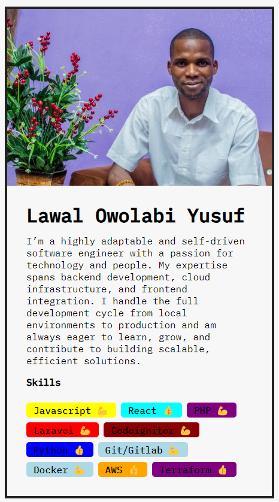

## ⭐ Profile Card Challenge 2  ⭐

A simple **React** challenge that showcases your **personal information and skillset**.  
Create a **profile card** with dynamic user data, highlighting your skills and introduction. Perfect for practicing **React fundamentals!**

# Getting Started with Create React App

This project was bootstrapped with [Create React App](https://github.com/facebook/create-react-app).

## Available Scripts

In the project directory, you can run:

### `npm start`

Runs the app in the development mode.\
Open [http://localhost:3000](http://localhost:3000) to view it in your browser.

The page will reload when you make changes.\
You may also see any lint errors in the console.

## 📌 Tech Stack

 

## Output:

## 📌 My process

- I started Udemy Course "The Ultimate React Course 2024 React, Redux & More" by Jonas Schmedtmann.<a href="" target="_blank"> **Check🚀 (Not Sponsered)**</a>
- I feel confident while writing REACT 👊.

## 📌 What I Learn

👉 Component  
👉 Props
👉 JSX

## 📬 Connect With Me

- **LinkedIn** - [Lawal Yusuf](https://www.linkedin.com/in/lawal-owolabi-yusuf-04976b143)
